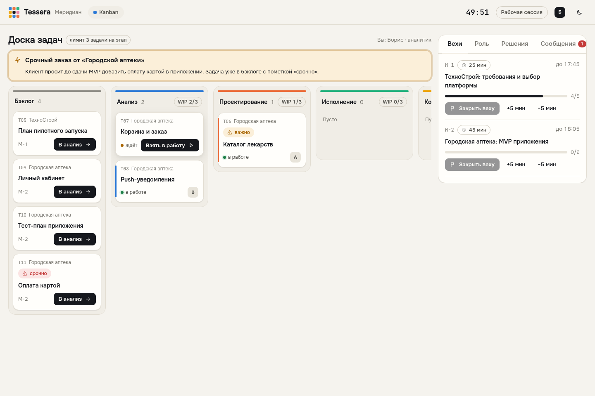
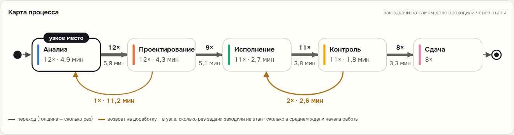
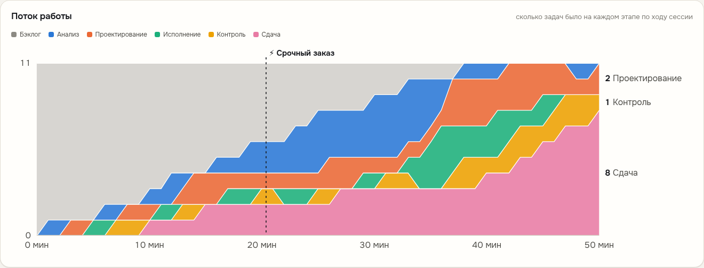
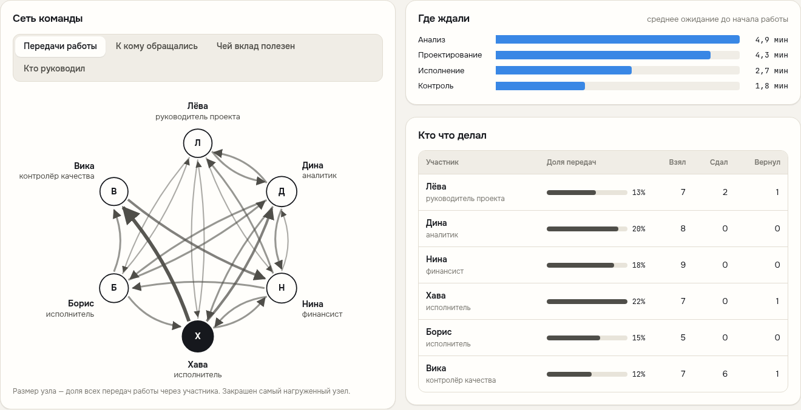

# Tessera

Платформа для исследования и развития командного взаимодействия на основе анализа бизнес-процессов.
Учебные команды управляют вымышленной компанией «Меридиан». Каждое их действие с задачами пишется
в неизменяемый журнал событий. После сессии команда видит карту своего реального процесса, а
исследователь получает данные для сравнения методик: Kanban, спринты, иерархия, самоорганизация.

*Каждый — фрагмент. Вместе — картина.* Концепция: [docs/concept.md](docs/concept.md) ([PDF](docs/tessera-concept-v0.1.pdf)).


## Запуск

Нужен только Docker.

```bash
cp .env.example .env        # поменяйте пароли
docker compose up -d --build
```

Платформа откроется на http://localhost:8080:

- **участники** входят с главной страницы по коду команды (удобно с телефона);
- **ведущий** работает в пульте http://localhost:8080/admin, пароль — `ADMIN_PASSWORD` из `.env`.

База данных живёт в томе `pgdata`, схема создаётся при первом старте. Остановить: `docker compose down`
(данные сохранятся); стереть всё: `docker compose down -v`.

### Посмотреть на демо-данных

Чтобы показать платформу до первого интенсива, поднимите **отдельный** экземпляр и заполните его
синтетическими сессиями: восемь команд, по две на каждую методику.

```bash
TESSERA_PORT=8081 docker compose -p tessera-demo up -d --build
docker compose -p tessera-demo exec api python -m app.demo
```

Откройте http://localhost:8081/admin → «Исследование». Журнал событий неизменяем, поэтому демо-данные
нельзя удалить из базы. Скрипт откажется запускаться, если в базе уже есть настоящие команды.
Различия между методиками в демо заданы вручную, выводами они не являются.

## Как проходит интенсив

| Этап | Участники видят | Система записывает |
|---|---|---|
| Сбор | Экран согласия, выбор роли, имя по желанию | Псевдоним `P-001`, роль, отдел, время согласия |
| Входной замер | Шкала психологической безопасности (7 пунктов), ясность целей | Ответы по пунктам |
| Брифинг | Легенда «Меридиана», правила своей методики, **факты, известные только своей роли** | — |
| Рабочая сессия | Доска задач, вехи со сроками, журнал решений, сообщения ведущего | Каждое изменение задачи и вехи — отдельное событие |
| Вбросы | Срочный заказ, урезание бюджета, уход сотрудника, изменение требований | Метка вброса, новые задачи |
| Пульс-опрос | Самочувствие, NASA-TLX, ясность целей, вклад; «кто помог», «кто руководил» | Ответы и сеть оценок коллег |
| Дебрифинг | Карта процесса, поток работы, сеть команды, узкие места | Заметки ведущего |
| Выходной замер | Повтор шкалы, рефлексия | Ответы |

Ведущий переключает этапы в пульте, и экраны участников меняются сами. Вбросы запускаются одной кнопкой.



**Методики** различаются правилами, которые система действительно соблюдает:

- **Kanban** — лимит незавершённой работы на каждом этапе (по умолчанию 3);
- **Спринты** — в работу можно взять только задачи, запланированные в текущий спринт;
- **Иерархия** — задачи распределяет, вехи закрывает и ключевое решение принимает руководитель проекта;
- **Самоорганизация** — система ничего не ограничивает.

**Скрытый профиль.** У каждой роли своя часть фактов о выборе платформы для клиента. Лучший вариант (C)
виден, только если сложить их вместе, поэтому качество решения команды измеряется числом.

## Дебрифинг

| | |
|---|---|
|  |  |

Команда видит:

- сколько задач сдано, время цикла и ожидания, долю доработок, соответствие эталону, вехи в срок;
- карту процесса: переходы между этапами, возвраты на доработку и узкое место;
- поток работы по минутам с отметками вбросов;
- сеть передач работы рядом с сетью оценок коллег: совпадают ли неформальные лидеры с формальными ролями;
- кто сколько задач брал и сдавал.



## Исследование и данные

Страница «Исследование» сравнивает методики по средним командным показателям и показывает таблицу всех сессий.


Выгрузки: журнал событий в CSV, XES (IEEE 1849) и OCEL 2.0 для PM4Py; ответы на опросы, оценки коллег,
журнал решений, вбросы, участники, сессии. Во всех выгрузках только псевдонимы.

Этика (раздел 09 концепции):

- участник не попадает в базу, пока не дал согласие; при отказе его устройство удаляется;
- имена хранятся отдельно, в схеме `identity`, и видны только своей команде; кнопка на странице
  «Исследование» удаляет их после завершения сбора;
- журнал событий, вбросы и решения только дополняются: изменить или удалить записи нельзя (триггер БД).

> Формулировки шкал в [`backend/instruments/surveys.json`](backend/instruments/surveys.json) — рабочие
> переводы. Перед основной серией замените их валидированными русскоязычными адаптациями.

## Устройство

```
docker compose
├── web   nginx: собранный фронтенд (React + TypeScript + Vite), прокси /api → api
├── api   FastAPI + psycopg; метрики и выгрузки — пакет tessera
└── db    PostgreSQL 16: схемы research (данные исследования), identity (имена), app (состояние сессий)
```

| Часть | Где |
|---|---|
| Схема исследовательской БД | [`schema/research_db.sql`](schema/research_db.sql) |
| Операционная схема приложения | [`schema/app_db.sql`](schema/app_db.sql) |
| Сценарий «Меридиана»: роли, факты, задачи, вехи, вбросы, правила методик | [`backend/scenarios/meridian-0.1.json`](backend/scenarios/meridian-0.1.json) |
| Опросники | [`backend/instruments/surveys.json`](backend/instruments/surveys.json) |
| Правила доски и запись журнала | [`backend/app/core.py`](backend/app/core.py) |
| Дебрифинг, сравнение, выгрузки | [`backend/app/analytics.py`](backend/app/analytics.py) |
| Метрики процесса и сети, XES/OCEL | [`tessera/`](tessera/) |
| Интерфейс | [`frontend/src/`](frontend/src/) |
| Шаблон захвата истории из настоящей ERP (на будущее) | [`schema/erp_capture_template.sql`](schema/erp_capture_template.sql) |

Сценарий и опросники — версионируемые JSON-файлы. Каждая сессия стартует из чистого снимка сценария,
поэтому условия у всех команд одинаковые. Новый сценарий — новый файл с новой `version`.

## Разработка

```bash
# база
docker compose up -d db          # или свой PostgreSQL

# API — http://localhost:8000
cd backend
python -m venv .venv && . .venv/bin/activate
pip install -r requirements-dev.txt && pip install -e ..
DATABASE_URL=postgresql://tessera:<пароль>@localhost:5432/tessera ADMIN_PASSWORD=dev uvicorn app.main:app --reload
# (чтобы подключиться к db из compose, пробросьте порт 5432 или используйте свой PostgreSQL)

# интерфейс — http://localhost:5173, /api проксируется на :8000
cd frontend && npm install && npm run dev
```

Тесты:

```bash
pytest tests                                                            # пакет tessera
TESSERA_TEST_PG=postgresql://postgres@localhost:5432/postgres pytest backend/tests   # API на настоящем PostgreSQL
cd frontend && npm run build                                            # типы и сборка
```

### Пакет `tessera` отдельно

Метрики и выгрузки можно считать и без платформы, по CSV-журналу:

```bash
pip install -e .
tessera metrics log.csv --out out/          # teams.csv, cases.csv, handover.csv, conditions.json
tessera export  log.csv --format xes --out log.xes
tessera simulate --out data/synthetic_log.csv
```

Упрощённый fitness в метриках — это доля переходов, разрешённых эталонной моделью, а не token-based
replay. Для статьи считайте fitness в PM4Py по выгрузке XES. PM4Py распространяется под AGPL v3,
поэтому в ядро не входит (группа `analysis` в `pyproject.toml`). Это важно, если аналитика пойдёт
в коммерческую ERP.
