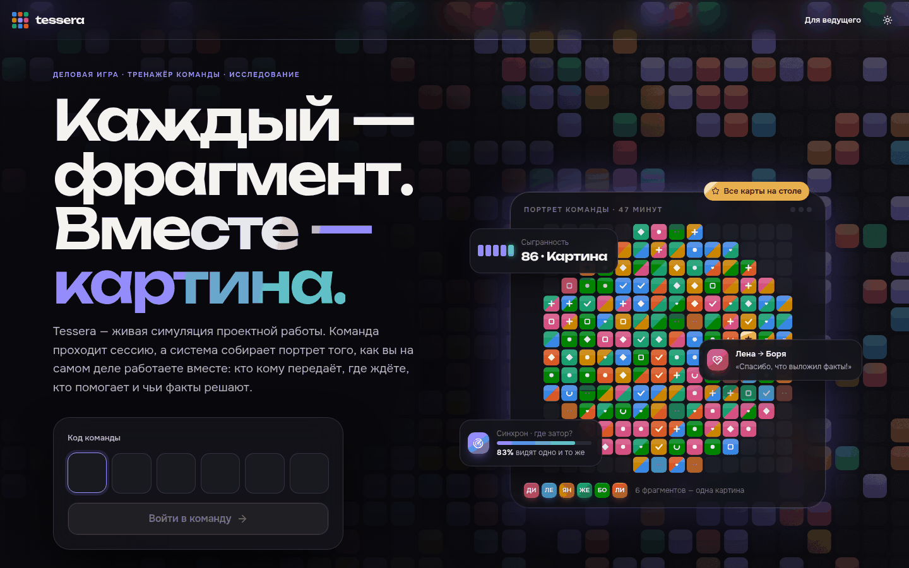
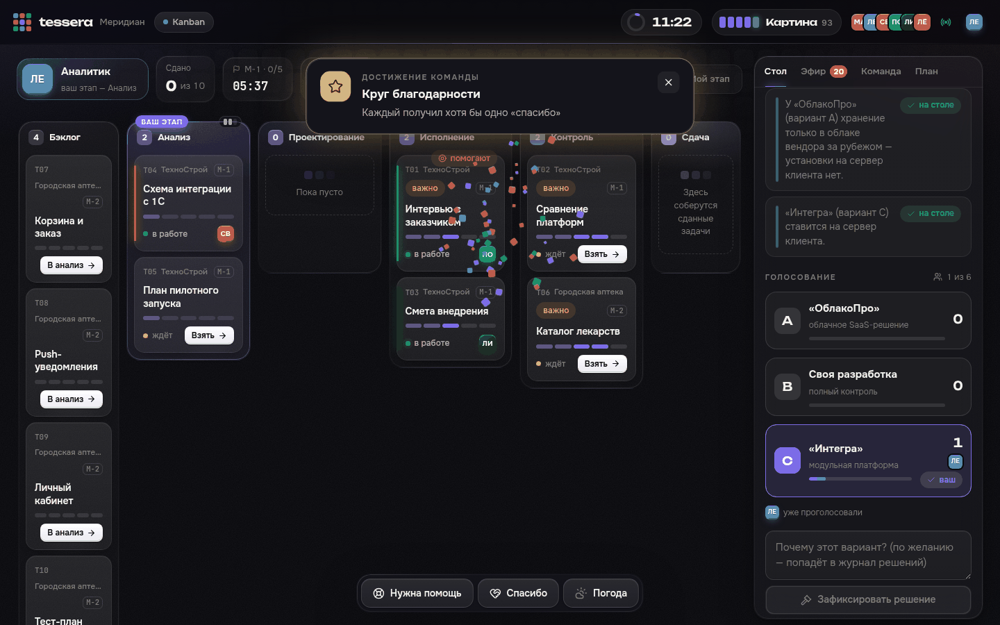
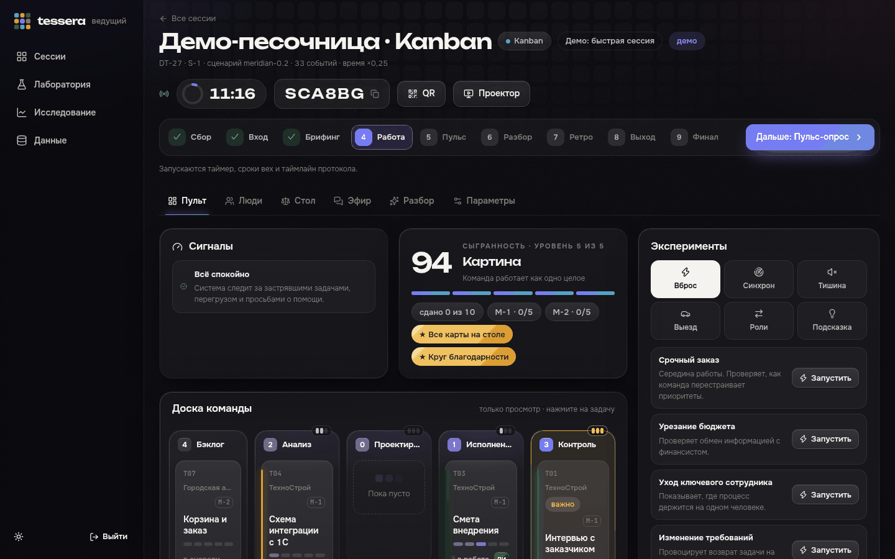
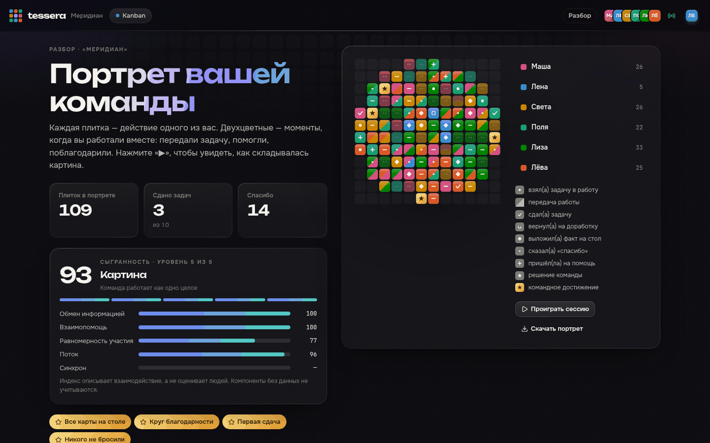
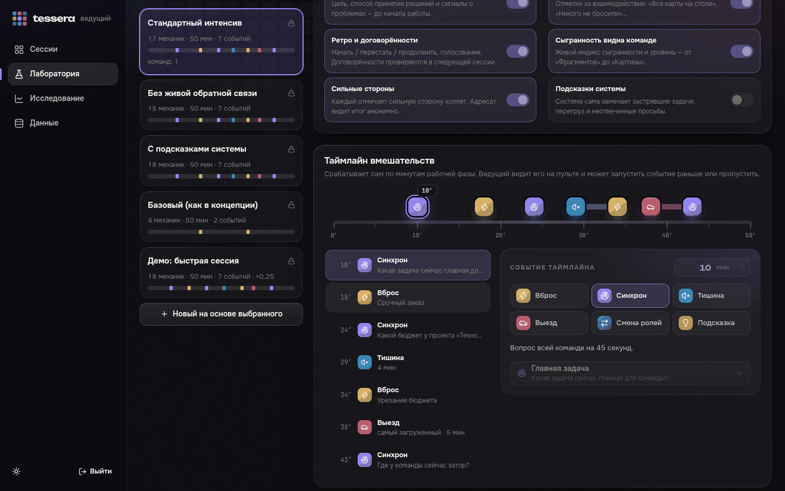
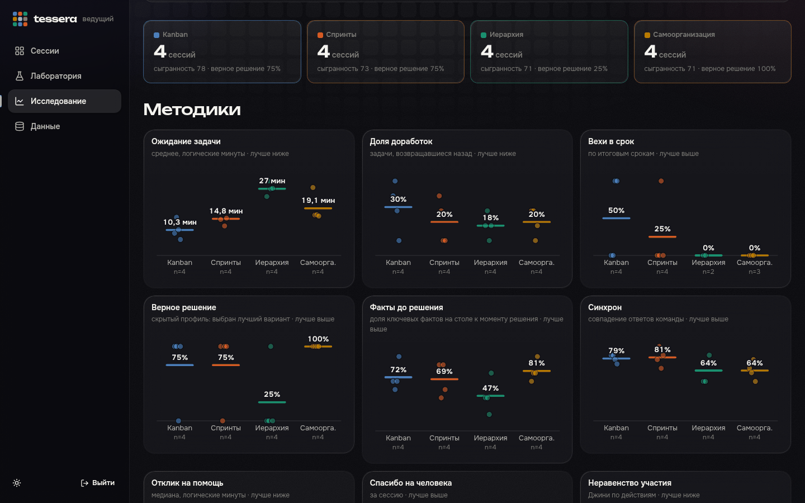
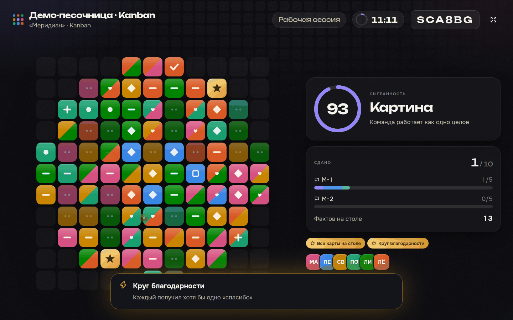

# Tessera

Tessera — живая деловая игра, тренажёр команды и исследовательская платформа.
Учебные команды ведут проекты вымышленной компании «Меридиан». Система собирает портрет того,
как они работают вместе:

- кто кому передаёт работу и где задачи ждут;
- чьи факты решают;
- кто приходит на помощь и кого благодарят.

После сессии команда видит этот портрет. Исследователь получает данные для сравнения методик
(Kanban, спринты, иерархия, самоорганизация) и механик взаимодействия.

*Каждый — фрагмент. Вместе — картина.* Концепция: [docs/concept.md](docs/concept.md) ([PDF](docs/tessera-concept-v0.1.pdf)).



## Запуск

Нужен только Docker.

```bash
cp .env.example .env        # поменяйте пароли
docker compose up -d --build
```

Платформа откроется на http://localhost:8080:

- **участники** входят с главной по шестизначному коду или по QR-коду с проектора (удобно с телефона);
- **ведущий** работает в кабинете http://localhost:8080/facilitator, пароль — `ADMIN_PASSWORD` из `.env`;
- **проектор** открывается из пульта: на нём живая мозаика команды, таймер и код для входа.

Переменные в `.env`:

| Переменная | Что задаёт |
|---|---|
| `POSTGRES_PASSWORD`, `ADMIN_PASSWORD` | Пароли базы и ведущего |
| `TESSERA_PORT` | Порт платформы (по умолчанию 8080) |
| `PUBLIC_URL` | Адрес для QR-кода на проекторе, например `https://tessera.example.ru`. Пусто — адрес из браузера ведущего |
| `TESSERA_PUBLIC_DEMO` | Кнопка «Попробовать одному» на главной: `1` — показывать, `0` — скрыть |

Данные хранятся в томе `pgdata`. Схема создаётся и обновляется миграциями при старте, база версии 1
обновляется сама. Остановить: `docker compose down` (данные сохранятся). Стереть всё: `docker compose down -v`.

### Посмотреть, как всё выглядит, одному

- **«Попробовать одному»** на главной создаёт песочницу. Вы — один участник, остальные пятеро — боты:
  они берут задачи, пишут в Эфир, просят помощи и благодарят. Внизу экрана — панель режиссёра:
  - переключать этапы;
  - запускать вбросы, Синхрон, тишину, выезд и смену ролей;
  - ускорять ботов;
  - смотреть глазами любого участника.
- **Демо-история** («Кабинет → Данные → Засеять») создаёт завершённые сессии по всем методикам,
  с опросами, фактами, благодарностями и Синхроном. На ней видно, как выглядят разбор и страница
  «Исследование». Из консоли: `docker compose exec api python -m app.demo --teams 2`.

Демо-команды помечены флагом. В анализ и выгрузки они попадают, только если явно включить переключатель.
Удаляются одной кнопкой (или `python -m app.demo --purge`). Настоящие данные при этом не трогаются.

## Как проходит сессия

| Этап | Участники | Система записывает |
|---|---|---|
| Сбор | Согласие, роль, имя по желанию, свой цвет в мозаике | Псевдоним `P-001`, роль, отдел, время согласия |
| Входной замер | Психологическая безопасность (PS7), ясность целей — по одному вопросу на экран | Ответы по пунктам |
| Брифинг | Легенда, правила методики, секретные факты роли, личный выбор до обсуждения, проверка правил, прогноз, командный договор | Выбор и уверенность, ответы проверки, прогноз, договор |
| Работа | Доска, вехи, общий стол фактов и голосование, Эфир, «Нужна помощь», «Спасибо», погода | Каждое действие — событие журнала; механики — отдельные таблицы |
| Пульс | NASA-TLX, уверенность в решении, выборы коллег, «Зеркало» | Ответы и сети оценок |
| Разбор | Портрет-мозаика, личная карточка «Ваш фрагмент», карта процесса, сеть команды, Синхрон, прогноз против реальности | Заметки ведущего |
| Ретро | Начать / перестать / продолжить, три голоса у каждого | Карточки и голоса; три лучших становятся договорённостями |
| Выход | Повтор PS7, сильные стороны коллег, выполнение прошлых договорённостей | Ответы |



**Методики** различаются правилами, которые система действительно соблюдает:

- **Kanban** — лимит незавершённой работы на этапе (по умолчанию 3);
- **Спринты** — в работу берутся только задачи текущего спринта;
- **Иерархия** — задачи распределяет, вехи закрывает и ключевое решение фиксирует руководитель;
- **Самоорганизация** — система ничего не ограничивает.

### Механики

Каждая механика — одновременно упражнение для команды и поведенческая метрика для исследователя.
Любую можно выключить в протоколе.

| Механика | Для команды | Что измеряет |
|---|---|---|
| Общий стол фактов + голосование | У каждой роли свои факты; лучший вариант виден, только если сложить их | Скрытый профиль: какие ключевые факты и когда стали общими, верность решения |
| Личный выбор до обсуждения | Решить самому до разговора | Сдвиг от личных мнений к решению команды |
| Эфир | Чат с @упоминаниями и ссылками на задачи | Метаданные коммуникации: кто, кому, когда (текст можно стереть) |
| «Нужна помощь» | Сигнал без стыда, отклик одним нажатием | Частота просьб и скорость отклика |
| «Спасибо» | Благодарность за конкретное | Сеть признания и взаимность |
| Погода | «Как мне сейчас» от ясно до бури | Динамика состояния по ходу сессии |
| Синхрон | Вопрос всем сразу на 45 секунд | Совпадение картины мира в команде |
| Прогноз и Зеркало | Предсказать результат, угадать стресс команды | Калибровка и взаимопонимание |
| Договор, ретро, договорённости | Правила до работы и выводы после | Выполнение договорённостей в следующей сессии |
| Сыгранность и достижения | Живой индекс от «Фрагментов» до «Картины» | Эффект видимой обратной связи (сравнивается протоколами) |

## Кабинет ведущего

- **Пульт сессии**:
  - этапы одной кнопкой;
  - сигналы системы: задача застряла, участник перегружен, просьба без ответа, факты не выложены, веха под угрозой;
  - доска команды, лента событий, люди;
  - эксперименты: вбросы, Синхрон, тишина, выезд к клиенту, смена ролей, подсказки;
  - таймлайн протокола с кнопками «запустить сейчас» и «пропустить»;
  - разбор со всеми графиками.
- **Проектор**: живая мозаика, таймер, сыгранность, QR-код для входа.
- **Лаборатория**: протоколы экспериментов — набор механик, параметры и таймлайн вмешательств
  в визуальном редакторе. Команда получает снимок протокола, поэтому условия не «поплывут» посреди исследования.
- **Серии команд** с блочной рандомизацией методик.
- **Исследование**:
  - методики рядом (точки команд и среднее — честно при малых выборках);
  - сравнение протоколов;
  - гипотезы концепции: безопасность и доработки, межотдельные передачи и срыв вех, неформальное лидерство.
- **Данные**: выгрузки, демо-данные и песочница, стирание имён и текстов.



| | |
|---|---|
|  |  |
|  |  |

## Данные и этика

Выгрузки (каждая — отдельно или одним архивом `all.zip`):

- журнал событий в CSV, XES (IEEE 1849) и OCEL 2.0;
- опросы, выборы коллег, сильные стороны;
- факты на столе, личный выбор, голоса, решения;
- метаданные Эфира, помощь, благодарности, погода, Синхрон;
- вмешательства, вбросы, договор, ретро, договорённости, достижения.

Во всех выгрузках только псевдонимы.

- Участник не попадает в базу, пока не дал согласие. При отказе его устройство удаляется.
- Имена хранятся отдельно (схема `identity`) и видны только своей команде. Тексты Эфира тоже хранятся
  отдельно от метаданных. После сбора и то и другое стирается одной кнопкой.
- Исследовательские таблицы только дополняются: изменить или удалить записи нельзя (триггер БД).
  Исключение — демо-команды, их можно удалить целиком.

> Формулировки шкал в [`backend/instruments/surveys.json`](backend/instruments/surveys.json) — рабочие
> переводы. Перед основной серией замените их валидированными русскоязычными адаптациями.

## Устройство

```
docker compose
├── web   nginx: собранный фронтенд (React 19 + TypeScript + Vite), прокси /api → api, живой канал без буферизации
├── api   FastAPI + psycopg; живой канал (SSE поверх PostgreSQL LISTEN/NOTIFY), фоновый цикл
│         (таймлайн протоколов, боты, достижения, подсказки) — один на кластер через advisory lock
└── db    PostgreSQL 16: research (данные исследования), identity (имена), app (состояние сессий)
```

| Часть | Где |
|---|---|
| Миграции схемы | [`schema/migrations/`](schema/migrations/) |
| Сценарий «Меридиана»: роли, факты, задачи, вехи, вбросы, Синхрон, достижения | [`backend/scenarios/meridian-0.2.json`](backend/scenarios/meridian-0.2.json) |
| Встроенные протоколы | [`backend/protocols/`](backend/protocols/) |
| Опросники | [`backend/instruments/surveys.json`](backend/instruments/surveys.json) |
| Правила доски и журнал | [`backend/app/core.py`](backend/app/core.py) |
| Механики взаимодействия | [`backend/app/mechanics.py`](backend/app/mechanics.py) |
| Вмешательства и таймлайн | [`backend/app/interventions.py`](backend/app/interventions.py) |
| Сигналы, сыгранность, достижения | [`backend/app/insights.py`](backend/app/insights.py) |
| Разбор, исследование, выгрузки | [`backend/app/analytics.py`](backend/app/analytics.py) |
| Боты и демо-история | [`backend/app/bots.py`](backend/app/bots.py), [`backend/app/demo.py`](backend/app/demo.py) |
| Метрики процесса и сети, XES/OCEL | [`tessera/`](tessera/) |
| Интерфейс | [`frontend/src/`](frontend/src/) |

Сценарий, опросники и протоколы — версионируемые JSON-файлы. Каждая сессия стартует из чистого снимка,
поэтому условия у всех команд одинаковые.

## Разработка

```bash
# база
docker compose up -d db          # или свой PostgreSQL

# API — http://localhost:8000
cd backend
python -m venv .venv && . .venv/bin/activate
pip install -r requirements-dev.txt && pip install -e ..
DATABASE_URL=postgresql://tessera:<пароль>@localhost:5432/tessera ADMIN_PASSWORD=dev uvicorn app.main:app --reload

# интерфейс — http://localhost:5173, /api проксируется на :8000
cd frontend && npm install && npm run dev
```

Тесты:

```bash
pytest tests                                                            # пакет tessera
TESSERA_TEST_PG=postgresql://postgres@localhost:5432/postgres pytest backend/tests   # API на настоящем PostgreSQL
cd frontend && npm run build                                            # типы и сборка
```

### Пакет `tessera` отдельно

Метрики и выгрузки можно считать и без платформы, по CSV-журналу:

```bash
pip install -e .
tessera metrics log.csv --out out/          # teams.csv, cases.csv, handover.csv, conditions.json
tessera export  log.csv --format xes --out log.xes
tessera simulate --out data/synthetic_log.csv
```

Упрощённый fitness в метриках — доля переходов, разрешённых эталонной моделью, а не token-based
replay. Для статьи считайте fitness в PM4Py по выгрузке XES. PM4Py распространяется под AGPL v3,
поэтому в ядро не входит (группа `analysis` в `pyproject.toml`). Это важно, если аналитика пойдёт
в коммерческую ERP.
